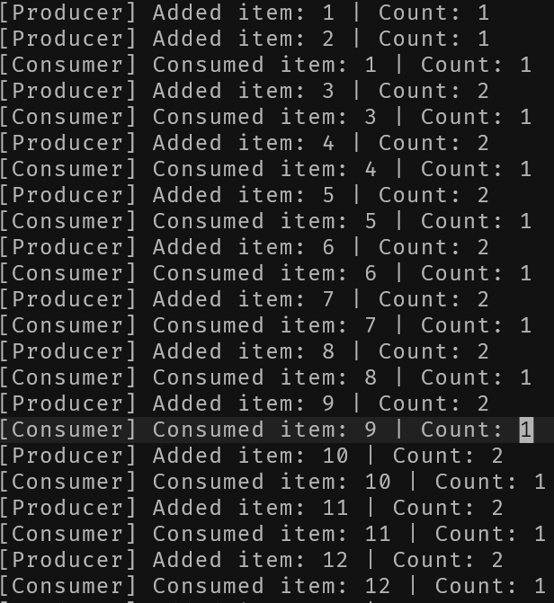
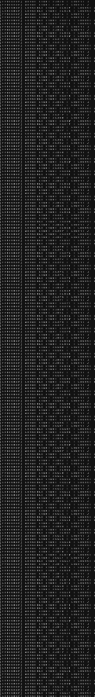

# Operating Systems Assignment 1
## Table of Contents
* [Changelog](#changelog)
* [0. Prerequisites](#0-prerequisites)
  * [0.1 Operating System](#01-operating-system)
    * [0.1.1 Recommended Environments](#011-recommended-environments)
  * [0.2 Shared Memory](#02-shared-memory)
    * [0.2.1 /dev/shm](#021-devshm)
    * [0.2.2 Creating a Missing tmpfs](#022-creating-a-missing-tmpfs)
  * [0.3 Compiler](#03-compiler)
  * [0.4 Build Tools](#04-build-tools)
    * [0.4.1 GNU Make](#041-gnu-make)
    * [0.4.2 C++ STL](#042-c-stl)
  * [0.5 Permissions and Filesystem Notes](#05-permissions-and-filesystem-notes)
* [1. Clone the Repository](#1-clone-the-repository)
* [2. Compile the Producer and Consumer](#2-compile-the-producer-and-consumer)
* [3. Run the Producer and Consumer](#3-run-the-producer-and-consumer)
  * [3a. Capture Output to a File](#3a-capture-output-to-a-file)
  * [3b. Read From the Logfile](#3b-read-from-the-logfile)
* [4. Stop the Running Processes](#4-stop-the-running-processes)
* [5. Clean Up the Binaries](#5-clean-up-the-binaries)
  * [5a. Clean Up Logfiles](#5a-clean-up-logfiles)
* [6. Shared Data](#6-shared-data)
* [7. Producer Process](#7-producer-process)
  * [7.1 Setup of Producer Process](#71-setup-of-producer-process)
    * [7.1.1 Shared Memory Handling](#711-shared-memory-handling)
    * [7.1.2 Semaphore Initializations](#712-semaphore-initializations)
    * [7.1.3 Process Initialization](#713-process-initialization)
* [8. Consumer Process](#8-consumer-process)
  * [8.1 Setup of Consumer Process](#81-setup-of-consumer-process)
    * [8.1.1 Shared Memory Handling](#811-shared-memory-handling)
    * [8.1.2 Process Initialization](#812-process-initialization)
* [9. Example Images](#9-example-images)


## Changelog

`6bf22d9` `2025-10-18 22:54` Add table of contents

`70e10e0` `2025-10-18 22:52` Re-format changelog

`a90340b` `2025-10-18 22:49` Update changelog

`2849a7e` `2025-10-18 22:28` Update picture formatting

`5d3d0a1` `2025-10-18 22:28` Update with additional picture

`320202e` `2025-10-18 22:22` More documentation on cloning repository

`ad34376` `2025-10-18 22:19` More notes on program requirements

`bf46775` `2025-10-18 22:09` Add notes on Operating System Requirements

`f9d22ac` `2025-10-17 21:42` Fix changelog formatting

`04751a5` `2025-10-17 21:41` Add changelog

`5868b9b` `2025-10-17 21:34` Add image

`3bced5b` `2025-10-17 21:30` Remove thread references, replace with processes

`72e75dd` `2025-10-17 21:24` Make them not threads, I guess? Not sure why that requirement is there

`711b5c0` `2025-10-17 21:13` Fix typos

`a76fdde` `2025-10-17 21:13` Add details on consumer thread creation

`781d077` `2025-10-17 20:53` Fix typos

`3cdeba2` `2025-10-17 20:41` Fix typo

`af6ce44` `2025-10-17 20:37` Fix formatting

`767e354` `2025-10-17 20:37` Clean up minor flaws

`689e96b` `2025-10-16 13:31` Begin documenting thread creation for producer

`3684539` `2025-10-16 13:21` Update README with description of consumer thread

`3f10966` `2025-10-16 13:17` Update README with description of producer thread

`6396c0e` `2025-10-16 13:10` Include DETAILED usage instructions in the README

`659f5e6` `2025-10-16 12:50` Begin documentation in the README for common information

`54c8b67` `2025-10-14 14:08` Fix consumer fd flags

`49f5931` `2025-10-14 14:06` Fix placement of semaphore mutex free

`06f30b4` `2025-10-14 14:05` Properly initialize semaphore flags

`53e570d` `2025-10-14 13:58` Fix failing to set empty from consumer thread

`c3a5d2d` `2025-10-14 13:56` Safely join and close consumer thread

`11d10f5` `2025-10-14 13:55` Create producer thread

`31848b9` `2025-10-14 13:54` Create consumer thread

`feb4333` `2025-10-14 13:51` Return mutex to consumer in producer thread

`03a5180` `2025-10-14 13:50` Add logs for producer thread

`1f7714e` `2025-10-14 13:49` Add an item to the buffer in the producer thread

`ea6d713` `2025-10-14 13:42` Wait on locks for producer

`0b4b394` `2025-10 -14 13:34`Setup semaphore flags for shared data

`46e2ae7` `2025-10-14 13:32`Initialize shared memory and semaphores

`ea28cde` `2025-10-14 13:26`Begin producer thread code

`af867f0` `2025-10-14 13:16`Start working on producer thread

`4f626e3` `2025-10-14 12:39`Set up SharedData struct

`5dfc03f` `2025-10-14 12:36`Add producer.cpp and consumer.cpp

`c9ae657` `2025-10-14 12:25` Initial commit


## Installation and Running Instructions
### 0. Prerequisites
#### 0.1 Operating System

This program relies on `shm_open`, `mmap`, `ftruncate`, `sem_init`, `sem_wait`, `sem_post` and `sem_destroy`.

These are part of the POSIX Standard, and are therefore supported on most Linux distributions, but are not fully supported on macOS or Windows.

If you attempt to run on these platforms, you will encounter missing header errors, or unresolved symbols at link time.

##### 0.1.1 Recommended Environments

* Ubuntu 22.04 (LTS),  Debian 12+, Fedora 39+ or Arch Linux (latest)
* A kernel version greater than 5.10 is advised for stable semaphore handling

#### 0.2 Shared Memory

##### 0.2.1 /dev/shm

`/dev/shm` must be mounted as a `tmpfs` filesystem (this is automatic in most distros)
You can verify `/dev/shm` with:

```sh
mount | grep shm
```

You should see something like:

```sh
tmpfs on /dev/shm type tmpfs (rw,nosuid,nodev)
```

##### 0.2.2 Creating a Missing tmpfs

If `/dev/shm` does not exist, create and mount it manually:

```sh
sudo mkdir -p /dev/shm
sudo mount -t tmpfs -o rw,nosuid,nodev tmpfs /dev/shm
```

#### 0.3 Compiler

Both `gcc` and `clang` are supported.

#### 0.4 Build Tools

##### 0.4.1 GNU Make

Version 4.3 or later.
Most distributions include this by default.

Verify your installation by using

```sh
make --version
```

##### 0.4.2 C++ STL

* `libstdc+`
* `libc++`

#### 0.5 Permissions and Filesystem Notes

The program writes to:

* `/dev/shm/Shared`
* `./producer`, `./consumer` binaries in the project directory
* Optional log files (`log.txt`) if output redirection is used.

Ensure that:

* The user has write permissions to `/dev/shm`
* No previous `/dev/shm/Shared` object exists, or else you may see:

```text
Error: failed to open shared memory (/Shared)
```

To clean up before running:

```sh
sudo rm -f /dev/shm/Shared
```


## 1. Clone the Repository

Clone from GitHub into any working directory (for example, a `$HOME` folder).

```sh
git clone https://github.com/monster0506/OperatingSystemsAssignment1
```

Then enter the directory.

```sh
cd OperatingSystemsAssignment1
```

Run ls to confirm that all files have been correctly cloned. Ensure that the output matches the below

```sh
>>> ls
.gitignore
consumer.cpp
example.png
example2.png
Makefile
producer.cpp
README.md
shared.hpp
```


## 2. Compile the Producer and Consumer

```sh
make producer
make consumer
# --or--
make
```


## 3. Run the Producer and Consumer

```sh
make run
# --or--
./producer & ./consumer &
```

### 3a. Capture Output to a File

```sh
( ./producer & ./consumer ) > log.txt 2>&1 &
```

### 3b. Read From the Logfile

```sh
tail -f log.txt
```


## 4. Stop the Running Processes

In a separate terminal window or `tmux` pane

```sh
pkill producer
pkill consumer
```


## 5. Clean Up the Binaries

```sh
make clean
# --or--
rm -f ./producer ./consumer
```

### 5a. Clean Up Logfiles

If you logged to a file, make sure to remove that file

```sh
rm -f log.txt
```


## 6. Shared Data

`shared.hpp`

```c
#pragma once
#include <semaphore.h>

const int MAX_ITEMS = 2;
const char* NAME = "/Shared";

struct SharedData {
    int buffer[MAX_ITEMS];
    int count;
    sem_t mutex;
    sem_t empty;
    sem_t full;
};
```

This is a common construct to both the producer and consumer. They will both need to access shared data and handle locks, so these struct members will be loaded into the shared memory block.

Both will need to access a buffer of size `2`, and hold a count of how many items are currently in the stack.

Both will also need semaphores for locking so they can edit the data without encountering race conditions (`mutex`). This asserts mutual exclusion.

Both will also need to check and set flags indicating if they have added or removed an item, or if there is an item or an empty slot (`full`, `empty`).


## 7. Producer Process

```c
void* produce(void* arg) {
SharedData* shm = static_cast<SharedData*>(arg);
int item = 0;

while (true) {
    item++;
    sem_wait(&shm->empty);
    sem_wait(&shm->mutex);

    shm->buffer[shm->count] = item;
    shm->count += 1;

    std::cout << "[Producer] Added item: " << item
        << " | Count: " << shm->count << std::endl;

    sem_post(&shm->mutex);
    sem_post(&shm->full);
}

return nullptr;
}
```

The above is the code for creating the producer process.

The process takes the shared memory block containing the common struct.

The process starts by converting the memory block to the struct, so that its members may be accessed.

Then, it sets the value of `item` to zero.
This is what will be pushed to the stack when there is an open spot. It will be incremented each time to track how many items the producer has generated.

The process will continuously increment item, then wait until the consumer indicates there is an empty slot, and gives the lock to the producer.

We then use the shared count to determine what spot we should add an item to in the buffer, and place our produced item at that index.

We increment count to indicate we are moving to the next available spot, or outside of the buffer.

We then return the mutex lock, and signal that we have added an item and at least one slot is full.


### 7.1 Setup of Producer Process

```c
int fd = shm_open(NAME, O_CREAT | O_RDWR, 0666);
if (fd == -1) {
std::cout << "Error: failed to open shared memory (" << NAME << ")"
    << std::endl;
return 1;
}

if (ftruncate(fd, sizeof(SharedData)) == -1) {
std::cout << "Error: failed to fit shared memory block to size of "
    "shared data ("
    << NAME << ")" << std::endl;
close(fd);
return 1;
}

void* addr = mmap(nullptr, sizeof(SharedData), PROT_READ | PROT_WRITE,
    MAP_SHARED, fd, 0);
if (addr == MAP_FAILED) {
std::cout << "Error: mmap failed" << std::endl;
close(fd);
return 1;
}

auto* shm = static_cast<SharedData*>(addr);

// Initialize semaphores
sem_init(&shm->mutex, 1, 1);  // binary semaphore for mutual exclusion
sem_init(&shm->empty, 1, MAX_ITEMS);  // count of empty slots
sem_init(&shm->full, 1, 0);           // count of full slots
shm->count = 0;

// start producer process
produce(shm);

munmap(addr, sizeof(SharedData));
close(fd);
shm_unlink(NAME);
```

#### 7.1.1 Shared Memory Handling

We first open a block of shared memory at the `NAME` "/Shared".

If this fails, we log and return early.

We then try to truncate the shared memory to the size of our `SharedData` block to ensure we are only using the necessary amount of memory, and that we cannot write out of bounds.

If this fails, we log and return early (safely closing the shared memory).

We then allocate real memory to the location of our shared memory with the correct size, and read and write privileges.

If this fails, we log and return early (safely closing the shared memory).

Then, we cast the block of shared memory to our `SharedData` struct, so we can access members.

#### 7.1.2 Semaphore Initializations

We setup our `mutex` semaphore, initialize it to 1, and indicate that it is shared across multiple processes.

We setup our `empty` semaphore, initialize it to 2, and indicate that it is shared across multiple processes.

We setup our `full` semaphore, initialize it to 0, and indicate that it is shared across multiple processes.

We setup `count` to indicate that the first slot is empty.

#### 7.1.3 Process Initialization

We run the `produce` function.

Once we finish, we handle unmapping memory and closing the file descriptor.


## 8. Consumer Process

```c
void* consume(void* arg) {
SharedData* shm = static_cast<SharedData*>(arg);

while (true) {
    sem_wait(&shm->full);
    sem_wait(&shm->mutex);

    int item =
        shm->buffer[shm->count - 1];
    shm->count -= 1;

    std::cout << "[Consumer] Consumed item: " << item
        << " | Count: " << shm->count << std::endl;
    sem_post(&shm->mutex);
    sem_post(&shm->empty);
}

return nullptr;
}
```

This process also takes the shared memory location, and casts it to our `SharedData` struct.

It waits until the producer indicates that an item has been added (`full`) and it gets the `mutex`.

It then pops the item from the stack, and decrements count to indicate that an item has been removed.

Finally, it releases the `mutex` and changes the empty flag to indicate that there is now an empty slot.


### 8.1 Setup of Consumer Process

```c
int fd = shm_open(NAME, O_CREAT | O_RDWR, 0666);
if (fd == -1) {
std::cout << "Error: failed to open shared memory (" << NAME << ")"
    << std::endl;
return 1;
}

void* addr = mmap(nullptr, sizeof(SharedData), 0x3, 0x01, fd, 0);

if (addr == MAP_FAILED) {
std::cout << "Error: mmap failed" << std::endl;
close(fd);
return 1;
}

auto* shm = static_cast<SharedData*>(addr);
// start consumer process
consume(shm);

munmap(addr, sizeof(SharedData));
close(fd);
return 0;
```

#### 8.1.1 Shared Memory Handling

We first open a block of shared memory at the `NAME` "/Shared".

If this fails, we log and return early.

We then try to truncate the shared memory to the size of our `SharedData` block to ensure we are only using the necessary amount of memory, and that we cannot write out of bounds.

If this fails, we log and return early (safely closing the shared memory).

We then allocate real memory to the location of our shared memory with the correct size, and read and write privileges.

If this fails, we log and return early (safely closing the shared memory).

Then, we cast the block of shared memory to our `SharedData` struct, so we can access members.

#### 8.1.2 Process Initialization

We run the `consume` function.

Once we finish, we handle unmapping memory and closing the file descriptor.


## 9. Example Images




